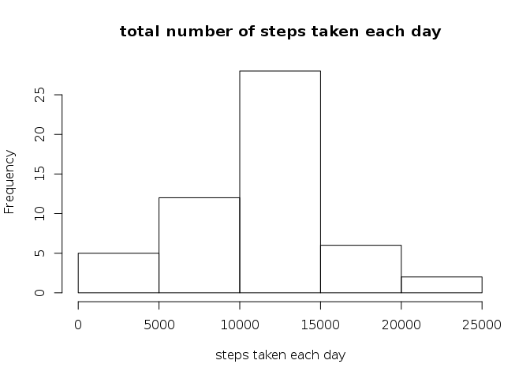

# Reproducible Research: Peer Assessment 1


## Loading and preprocessing the data

```r
data<-read.csv("activity.csv")
```

data overview:

```r
head(data)
```

```
##   steps       date interval
## 1    NA 2012-10-01        0
## 2    NA 2012-10-01        5
## 3    NA 2012-10-01       10
## 4    NA 2012-10-01       15
## 5    NA 2012-10-01       20
## 6    NA 2012-10-01       25
```


## What is mean total number of steps taken per day?

 Calculate the total number of steps taken per day

```r
  stepPerDay <- aggregate(data$steps, list(data$date), sum)
  names(stepPerDay) <- c("Date","steps")
```

new data:

```r
head(stepPerDay)
```

```
##         Date steps
## 1 2012-10-01    NA
## 2 2012-10-02   126
## 3 2012-10-03 11352
## 4 2012-10-04 12116
## 5 2012-10-05 13294
## 6 2012-10-06 15420
```

 If you do not understand the difference between a histogram and a barplot, research the difference between them. Make a histogram of the total number of steps taken each day

```r
hist(stepPerDay$steps, main="total number of steps taken each day", xlab="steps taken each day")
```

 

 Calculate and report the mean and median of the total number of steps taken per day
mean:

```r
mean(stepPerDay$steps, na.rm=T)
```

```
## [1] 10766.19
```

median:

```r
median(stepPerDay$steps, na.rm=T)
```

```
## [1] 10765
```


## What is the average daily activity pattern?
 Make a time series plot (i.e. type = "l") of the 5-minute interval (x-axis) and the average number of steps taken, averaged across all days (y-axis)

```r
library(lattice)

data$finterval <- factor(data$interval)
stepByInterval <- aggregate(steps ~ finterval, data=data, mean, na.exclude=T)
names(stepByInterval) <- c("interval","step")
xyplot(step ~ interval, data=stepByInterval, type="l", grid=TRUE, ylab="Number of steps", xlab="5-min. intervals from midnight", main="Average number of steps by 5-minutes intervals")
```

 
 Which 5-minute interval, on average across all the days in the dataset, contains the maximum number of steps?

```r
interval <- stepByInterval$interval[which.max(stepByInterval$step)]
```
## Imputing missing values

 Calculate and report the total number of missing values in the dataset (i.e. the total number of rows with NAs)
missing step:

```r
sum(is.na(data$steps))
```

```
## [1] 2304
```
missing date:

```r
sum(is.na(data$date))
```

```
## [1] 0
```
missing interval:

```r
sum(is.na(data$interval))
```

```
## [1] 0
```
 Devise a strategy for filling in all of the missing values in the dataset. The strategy does not need to be sophisticated. For example, you could use the mean/median for that day, or the mean for that 5-minute interval, etc.

 Create a new dataset that is equal to the original dataset but with the missing data filled in.

```r
newdata <-data
for(row in 1:nrow(newdata)){
  if (is.na(newdata$steps[row])) {
    filVal <- stepByInterval$step[stepByInterval$interval == newdata$interval[row]];
    newdata$steps[row] <- filVal;
  }
}
sum(is.na(newdata$steps))
```

```
## [1] 0
```

 Make a histogram of the total number of steps taken each day and Calculate and report the mean and median total number of steps taken per day. Do these values differ from the estimates from the first part of the assignment? What is the impact of imputing missing data on the estimates of the total daily number of steps?

```r
sumStepPerDay <- aggregate(newdata$steps, list(data$date), sum)
names(sumStepPerDay)<- c("date","steps")
hist(sumStepPerDay$steps, main="total number of steps taken each day", xlab="steps per day")
```

 


## Are there differences in activity patterns between weekdays and weekends?
 Create a new factor variable in the dataset with two levels – “weekday” and “weekend” indicating whether a given date is a weekday or weekend day.

```r
newdata$day <- "weekday"
newdata$day[weekdays(as.Date(newdata$date), abb=T) %in% c("sáb","dom")] <- "weekend"
```
number of weekday and weekend:

```r
table(newdata$day)
```

```
## 
## weekday weekend 
##   12960    4608
```

 Make a panel plot containing a time series plot (i.e. type = "l") of the 5-minute interval (x-axis) and the average number of steps taken, averaged across all weekday days or weekend days (y-axis). See the README file in the GitHub repository to see an example of what this plot should look like using simulated data.

```r
datawdwe <-  aggregate(steps ~ interval + day, data=newdata, mean)
xyplot(steps ~ interval, data=datawdwe, groups=datawdwe$day, type="l", grid=T, main="weekday vs weekend")
```

 
